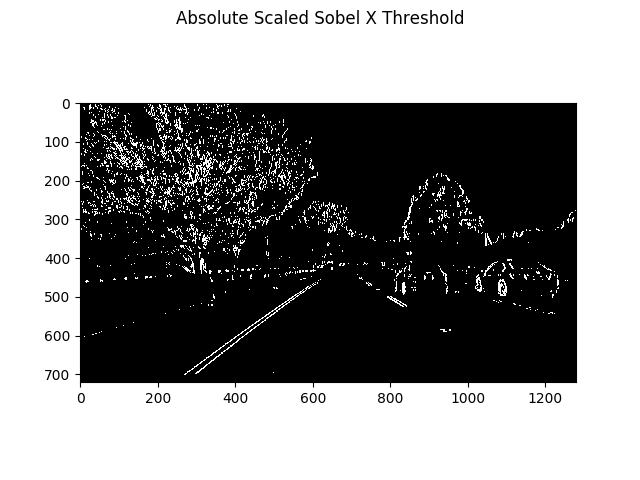
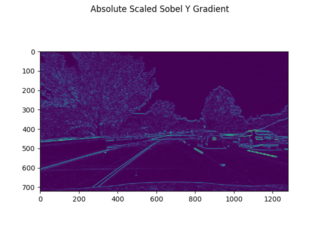
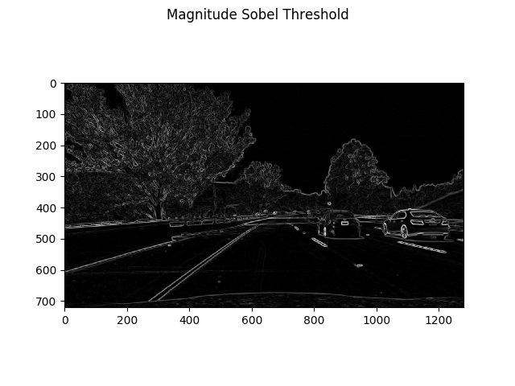
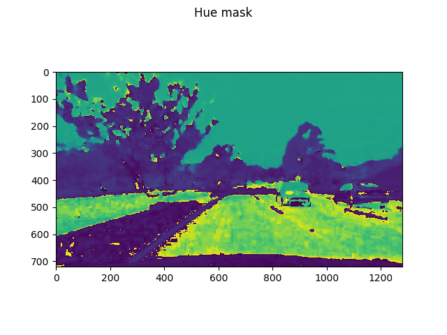
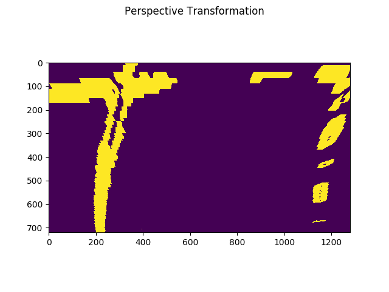
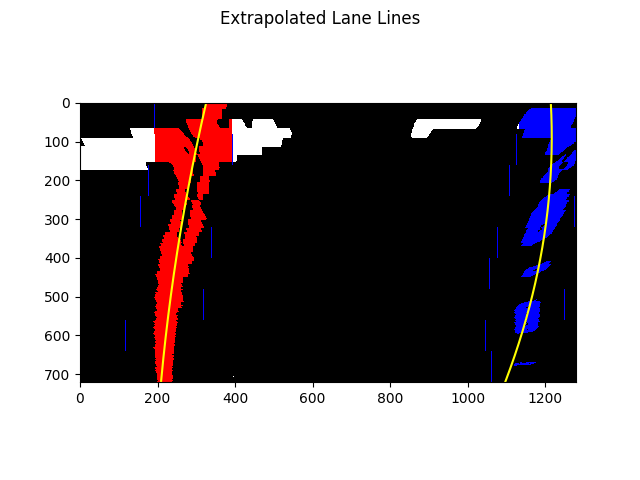
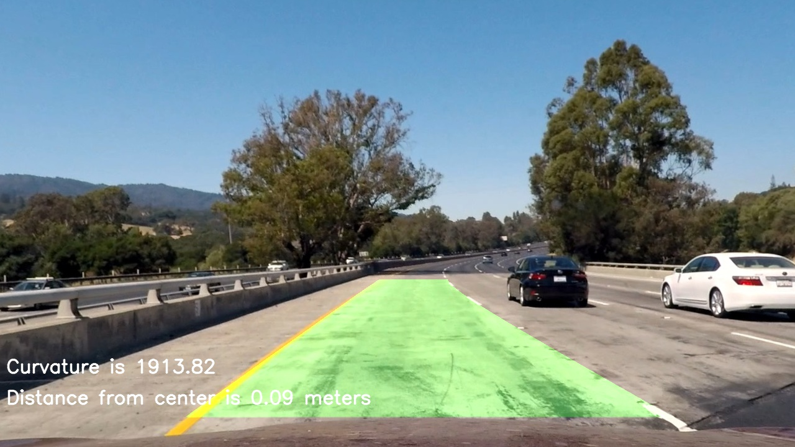
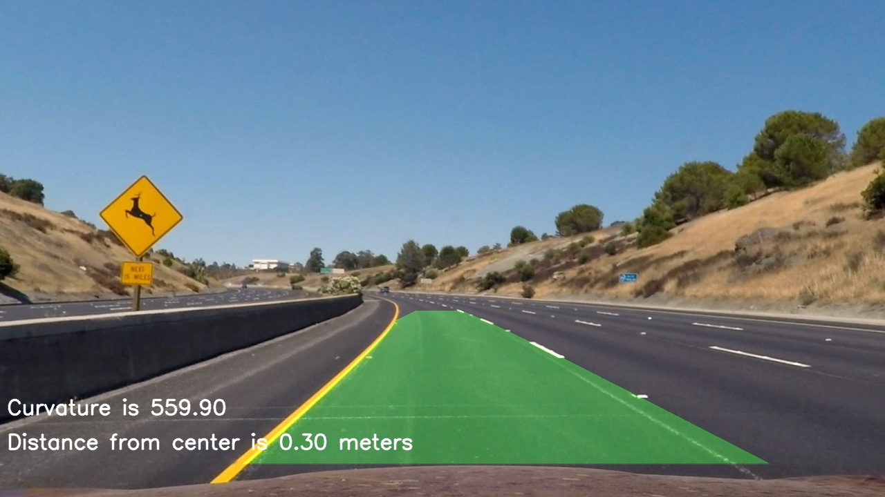
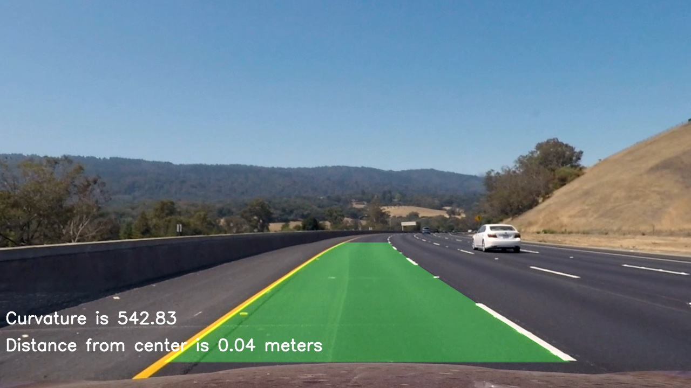

# Advanced Lane Finding - Udacity Project

This is the advanced lane finding project for the [Udacity Self Driving Car Nanodegree](https://www.udacity.com/course/self-driving-car-engineer-nanodegree--nd013).

The goal of the project is to create a more advanced pipeline for detecting lanes and highlighting them. The goals, in specific:

* Compute the camera calibration matrix and distortion coefficients given a set of chessboard images.
* Apply a distortion correction to raw images.
* Use color transforms, gradients, etc., to create a thresholded binary image.
* Apply a perspective transform to rectify binary image ("birds-eye view").
* Detect lane pixels and fit to find the lane boundary.
* Determine the curvature of the lane and vehicle position with respect to center.
* Warp the detected lane boundaries back onto the original image.
* Output visual display of the lane boundaries and numerical estimation of lane curvature.

## Files

Here are the files being discussed in this writeup -

1. `camera-calibrate.py` - Perform camera calibration and save the results to a pickle file to be used later
2. `camera-calibration.p` - The aforementioned output of the camera calibration
3. `pipeline.py` - Contains a function `functionName` that will return the image with a highlighted lane, calculated left lane, right lane, and average road curvatures.
4. `video.py` - Will take a video file and then output the same video, with overlayed lane highlighting and average curvature overlayed
5. `generate_example_images.py` - will run the pipeline process and save the overlayed images from the test_images folder
6. `examples` folder - This folder will contain screen shots of each stage of the program, generated by calling pipeline() function with the parameter debug=True

## Pipeline process

The following is a discussion of each part of the pipeline process, with example images of what occured (if available) and what I did.

### The pipeline function

The pipeline function begins on line 463 in `pipeline.py`. It accepts an image and whether or not to show individual steps as completed via the debug parameter. It returns the highlighted lane image, the left, right, and average curve radii.

The pipeline feeds steps into one another, in this order:

1. `undistort` - Undistory the image using the camera calibration
2. `combinedThresholds` - Get the combined sobel and color thresholds
3. `perspectiveTransform` - Transform the image into an overhead perspective
4. `detectLaneLines` - using the overhead image and a sliding window histogram, detect the lane lines and generate polynomials for each lane line
5. `drawLane` - Given the polynomials for the lane lines and the image provided, create a highlight over the lane.

### Calibrate Camera

The camera is calibrated not in the pipeline file but in `camera-calibrate.py` - this is done separate because camera calibration takes some time and would be too slow to repeatedly re-do per frame. The file, `camera-calibration.p`, is a pickle file with the camera's calibration results for quicker access during the pipeline.

The calibration is done by passing several images of a chessboard taken by the camera into a function `cv2.findChessBoardCorners`, appending all of the image points and object points to the aforementioned pickle file. We can use these to undistort the image inside the pipeline.

### Undistort image

This can be found on line 50 of `pipeline.py`. It utilizes the `cv2.calibrateCamera` function, passing in the previously generated calibrated camera values generated earlier in `camera-calibray.py`.

### Combined Thresholds

The combined thresholds function, line 222, in itself is a combination of several other functions.

#### Combined Sobel Thresholds

`combinedSobel` on line 205 calls yet more modular functions to handle sobel gradient mask generation.

##### Absolute Sobel

In `absoluteSobel`, line 110, I convert the image into grayscale and take the sobel gradient of the image in the x and y directions. I take the absolute value of each of these gradients, and then scale them to 1-255 (for color/image space). I take a threshold of each the x and y sobel gradients, creating a binary mask for each.

##### Magnitude Sobel

In `magnitudeSobel`, line 156, I convert the image to gray and calculate the sobel gradient in each the x and y directions. I then take the magnitude (squarte route of each squared and added) of the gradients, and generate a binary mask from thresholding that.

##### Combined

The `combinedSobel` function then merges these binary masks.

#### Color Threshold

In `colorThreshold`, line 71, we convert the image into the HLS colorspace. This is done to better isolate color thresholding irregardless of brightness from sun/shadows.

From this, we remove the hue and saturation channels to work with specifically with them. We create binary threshold masks from these channels. I found success detecting both white and yellow lane lines reliably by combining these two threshold masks together.

#### Combined

I then combine the sobel and color thresholds.

### Perspective Transform

Now that we have the thresholded image, we take a perspective transform in function `perspectiveTransform` on line 242.

Here, we take an interest area (an area selected to be just the lane in front of us in most images) and transform the perspective to make the image appear as if we're taking a bird's eye view of it. We also generate the inverse of this transformation, for later use. We utilize OpenCV's `cv2.getPerspectiveTransform` and `cv2.warpPerspective` functions to do this.

### Detect Lane Lines

The function `detectLaneLines` on line 278 creates a sliding window of the image, where we consider rows from the bottom up to detect the two highest peaks of data (left and right of the center of the image) by creating a histogram.

We iterate over the image, row by row, until we form a series of points that represent a line going over each lane line.

We then use numpy's `polyfit` function to find a second order polynomial function for each lane line. Below are the lines plotted over the lane lines - it's a good match!

We also calculate the curvature of each lane using Udacity provided pixels per meter calibration from the cameras.

### Highlight the lane

In the function `drawLane` on line 399, we use the aforementioned inverse perspective transform generated during the perspective transform step, and the extrapolated lane line polynomials + detected data, to draw a highlight area over where we think the lane is.

## Test images 
The file `generate_example_images.py` will iterate over all files in the `test_images` folder, run the pipeline on each, and output it to `output_images`. Below are some examples:

 
 
 

## Video output

`video.py` file will load the pipeline and execute the pipeline on each frame of a provided video - for the project, I ran it on `project_video.mp4`. The output can be found in `output_images/project_video_output.mp4`.
